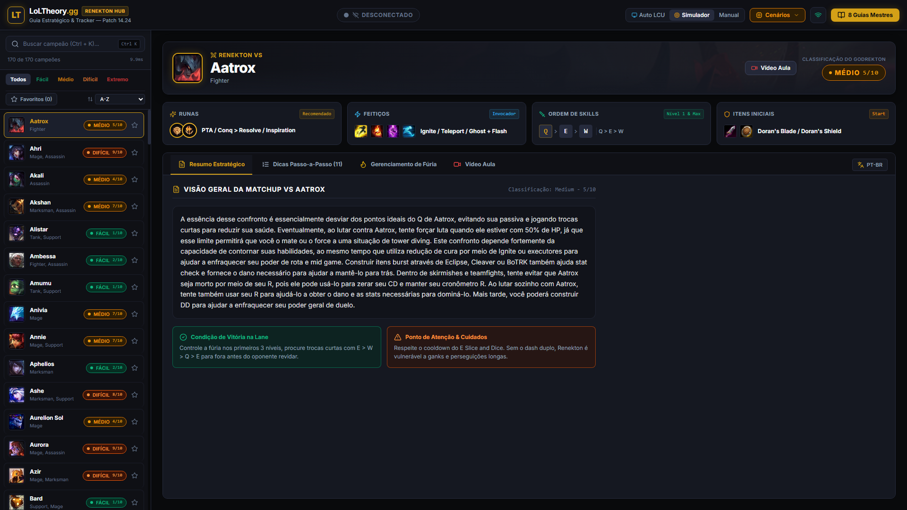
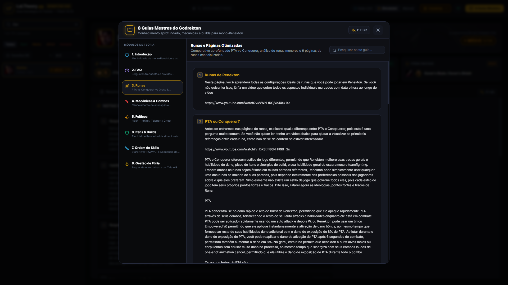
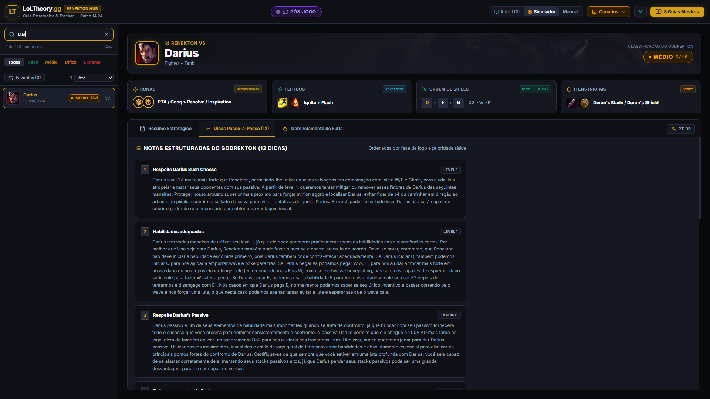
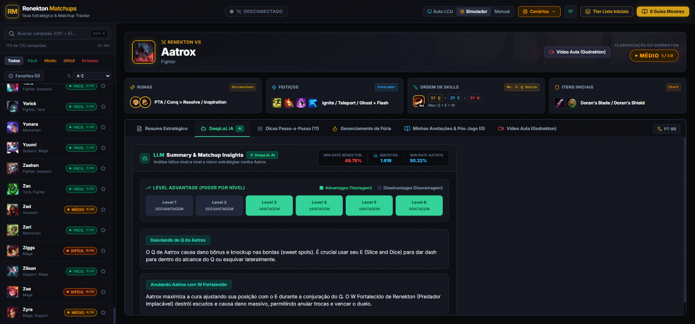

<div align="center">

# 🐊 Renekton Matchups Desktop Tool

### *A Community Tribute to [Godrekton](https://www.youtube.com/@Godrekton) & [r/RenektonMains](https://www.reddit.com/r/RenektonMains/)*

[](https://opensource.org/licenses/MIT)
[](https://github.com/GuhQuintino/renekton-matchups/releases/latest)
[](https://tauri.app/)
[](https://react.dev/)
[](https://www.typescriptlang.org/)
[](https://www.sqlite.org/)
[](#-universal-language-support)

<p align="center">
  <b>The offline & real-time companion app for Renekton Toplane OTPs and enthusiasts.</b><br/>
  Powered by Godrekton's 12+ years of mono-Renekton mastery and his legendary 170-champion matchup spreadsheet.
</p>

[📥 Download Easy Windows Installer](#-easy-installation-for-gamers-no-coding-required) •
[App Tutorial & Screenshots](#-how-to-use-the-app-visual-tutorial) •
[Community Note](#-honest-note-from-the-creator) •
[Features](#-key-features) •
[Godrekton's Guides](#-godrektons-8-master-guides) •
[Versão em Português](#-sobre-o-projeto-em-português)

---

</div>

## ⚠️ Honest Note from the Creator

> [!IMPORTANT]
> **Please Read Before Using:**
> - **Who I Am**: I am a Support main and an avid Renekton enthusiast. I only play Renekton when filled Top or Mid. Because I don't play him every game, I always need to study his matchups before ranked games to prepare properly. A huge source of knowledge I've relied on is **Godrekton's** YouTube videos and his spreadsheet, so I decided to turn that compendium into a dedicated offline desktop tool.
> - **I Am NOT a Programmer**: I built this entire project utilizing **Artificial Intelligence**, with zero prior programming background. Because of that, the application is far from perfect!
> - **Help from the Community is Needed and Wanted!**: The code is **100% open-source**. If you are a developer, designer, or veteran Renekton player, pull requests, issues, and ideas are very welcome!
> - **Current App State**:
>   - 🟢 **As a Matchup Study & Theory Tool: EXCELLENT.** Fast and completely offline: features all 170 matchups with Godrekton's notes, 8 master guides, combo visualizers, level 1 ability leveling tips, tier lists, and an embedded SQLite post-game notes system to track your personal winrate and reminders per matchup.
>   - 🟡 **Pre & In-Game Live Tracking: EXPERIMENTAL (Manual Use Recommended).** The local League client API integration works in many scenarios, but **I currently recommend using the app manually**: it can sometimes detect the wrong enemy champion (and won't always allow switching), detects any match even when you aren't playing Renekton, and can desync depending on system conditions. Manual matchup selection is always fast and 100% reliable!

---

## 📥 Easy Installation for Gamers (No Coding Required!)

You **do NOT need** to install Node.js, Rust, Git, or write any commands. Simply install the pre-compiled application:

1. Go to the official **[Releases Page](https://github.com/GuhQuintino/renekton-matchups/releases/latest)**.
2. Download **`Instalador-Renekton-Matchups.exe`**.
3. Double-click the downloaded file and follow the standard Windows setup wizard (Next $\rightarrow$ Finish).
4. Launch **Renekton Matchups** from your Desktop shortcut or Windows Start Menu!

*(If Windows SmartScreen shows an alert, click "More info" $\rightarrow$ "Run anyway". The app is open-source and safe).*

---

## 📸 How to Use the App (Visual Tutorial)

### 1. Champion Search & Instant Filters
Quickly locate any matchup by typing the champion's name or alias (e.g. *Mundo* or *Wukong*). Filter champions by difficulty rating (*Easy, Medium, Hard, Extreme*) or view your starred favorites.

<div align="center">
  
</div>

---

### 2. Tactical Matchup Breakdown & 3-Second Pre-Game Decision
Before the game starts, get the critical setup within 3 seconds:
- **Primary & Secondary Runes** (e.g. PTA vs Conqueror)
- **Summoner Spells** (e.g. Flash + Ignite vs Flash + TP)
- **Starting Items** (D-Blade vs D-Shield vs Long Sword Rush)
- **Skill Priority & Level 1 Start**
- **Godrekton's Step-by-Step Strategic Notes** for the lane

<div align="center">
  
</div>

---

### 3. Godrekton's 8 Master Guides & Level 1 Tier List
Click the **"Guias Gerais / Master Guides"** or **"Level 1 Tier List"** buttons in the header to access Godrekton's deep-dive knowledge:
- Complete Runes Guide, Mechanics & Animation Cancels, Builds & Items, Fury Management, Summoner Spells, and the Level 1 Ability Starting Tier List.

<div align="center">
  
</div>

---

### 4. Post-Game Notes & Personal Winrate Tracker
Log your tactical takeaways after every match:
- Record your match result (**Win / Loss / Remake**).
- Rate felt difficulty from **1 to 5 stars**.
- Save notes on **what worked**, **mistakes made**, **KDA**, and **build**.
- Stored permanently in your local **SQLite** database to calculate your personal winrate against each specific champion over time!

<div align="center">
  
</div>

---

### 5. High-Elo Analytics & Combos Visualizer
Explore high-elo Korean OTP tendencies, power spikes, winrate curves, and visual breakdown of Renekton combos (The Panther Combo, Short Trades, All-In sequences).

<div align="center">
  
</div>

---

## 🌟 The Tribute

This application was engineered as a tribute to **Godrekton**, one of the most dedicated and knowledgeable Renekton one-tricks in League of Legends history (12+ years playing the Butcher of the Sands). His comprehensive spreadsheet covering all **170 matchups**, level 1 advantages, fury manipulation, and itemization has helped thousands of top laners climb the ladder.

- 📺 **YouTube**: [Godrekton's Official Channel](https://www.youtube.com/@Godrekton)
- 💬 **Reddit**: Join the discussion on [r/RenektonMains](https://www.reddit.com/r/RenektonMains/)

---

## ⚡ Key Features

### 🌐 Universal Language Support (English & Portuguese)
Switch seamlessly between **English (`en`)** and **Português do Brasil (`pt-br`)** with one click in the header. All 170 champion strategies, master guides, combo visualizers, item names, and UI elements adapt instantly with zero reloading.

### 🐊 Complete 170-Champion Matchup Database
- **Instant Search**: Sub-millisecond lookup by name or alias.
- **3-Second Pre-Game Decision Bar**: Recommended Runes, Summoner Spells, Starting Items, and Skill Leveling path.
- **Difficulty Grading**: Ranked from 1/10 (Very Easy) to 10/10 (Extreme Nightmare) with Godrekton's exact tactical notes.

### 🔄 Real-Time League Client (LCU) & In-Game Detection *(Experimental)*
- **Auto LCU Sync**: Reads the League of Legends lockfile and Live Client Data API.
- **Picks & Bans Detection**: Automatically parses champion select, filters enemy team picks, and highlights probable Toplaners.
- **Live In-Game HUD**: Locks your lane opponent automatically at game start with a 1-click **Lane Swap** button for flex drafts.

### 📝 Post-Game Match Notes & Performance Tracker
- Log tactical lessons directly into your local embedded **SQLite** database.
- Track match outcome, felt difficulty rating, what worked, mistakes made, KDA, and item build.
- Generates dynamic opponent-specific Winrate and average felt difficulty statistics.

### 🛡️ 100% Offline & Local-First Architecture
- Pre-seeded embedded SQLite engine (`rusqlite`) and local SVG icon fallbacks.
- Strictly read-only local API calls, zero memory modification, compliant with Riot Games third-party policies.

---

## 📖 Godrekton's 8 Master Guides

| Guide | Description |
|---|---|
| **1. Introduction & Mindset** | The philosophy of playing Renekton, lane tempo, and power spikes |
| **2. Renekton FAQ** | Answers to common OTP dilemmas, wave control, and teamfight positioning |
| **3. Runes Deep Dive** | When to take PTA, Conqueror, or Grasp of the Undying |
| **4. Mechanics & Combos** | Animation cancels, Panther Combo execution, and Ironspike/Tiamat weaves |
| **5. Summoner Spells** | Flash + Ignite vs Flash + Teleport vs Ghost matchups |
| **6. Builds & Itemization** | Core Bruiser vs Lethality vs Frontline Tank paths |
| **7. Ability Starts & Max Order** | When to max Q vs W vs E first and reactive level 1 skill points |
| **8. Fury Management** | Maintaining 50+ Fury, wave setup, and empowered ability priorities |

---

## 🛠️ Build from Source (For Developers)

If you want to contribute, modify code, or compile from source:

### Prerequisites
- [Node.js](https://nodejs.org/) (v18+)
- [Rust & Cargo](https://www.rust-lang.org/tools/install) (latest stable)
- Visual Studio C++ Build Tools

### Commands

```bash
# 1. Clone repository
git clone https://github.com/GuhQuintino/renekton-matchups.git
cd renekton-matchups

# 2. Install dependencies
npm install

# 3. Start development server (with native Tauri + Rust)
npm run tauri:dev

# 4. Run automated test suite (203 tests)
npm test

# 5. Build release installer
npm run tauri:build
```

---

## 🇧🇷 Sobre o Projeto (Em Português)

### ⚠️ Nota Sincera do Criador
> **Aviso Importante:**
> - **Quem sou eu**: Sou um entusiasta de Renekton, porém sou main suporte e só jogo com ele quando caio top ou mid. Por não jogar tanto com ele com frequência, acabo tendo que rever as matchups para me preparar melhor nas ranqueadas. Uma grande fonte de conhecimento que sempre utilizei é a planilha e os vídeos do **Godrekton**, então decidi transformar todo esse conhecimento em uma ferramenta independente para desktop.
> - **Não sou programador**: Desenvolvi este aplicativo inteiro **utilizando 100% Inteligência Artificial**, sem conhecimento prévio de desenvolvimento de software. Por isso, o app está longe de ser perfeito!
> - **A comunidade é muito bem-vinda para ajudar!**: O código é **100% open source sob licença MIT**. Quem souber programar ou quiser colaborar com melhorias, fique à vontade para abrir Issues e enviar Pull Requests no GitHub!
> - **Estado do Aplicativo**:
>   - 🟢 **Como ferramenta de estudo de matchups: É EXCELENTE.** Extremamente rápido, dá para utilizar offline, apresenta todos os 170 matchups com as anotações do Godrekton, os 8 guias principais, visualizadores de combos, tier list, o que upar nível 1 e um sistema integrado de anotações pós-jogo em SQLite para acompanhar sua taxa de vitórias pessoal e deixar lembretes para cada matchup.
>   - 🟡 **Acompanhamento ao vivo antes e durante o jogo: Ainda EXPERIMENTAL (Recomendo uso manual).** O gancho da API do cliente local do League funciona em muitos casos, mas **recomendo utilizar de forma manual**: ele pode errar o campeão adversário e às vezes não dá para trocar, vai sempre detectar a partida mesmo que você não esteja de Renekton, e pode dessincronizar dependendo das condições do sistema. A consulta manual é instantânea e 100% estável!

### 📥 Instalação Fácil para Jogadores (Sem complicação)
1. Vá na aba de **[Releases](https://github.com/GuhQuintino/renekton-matchups/releases/latest)** aqui do GitHub.
2. Baixe o arquivo **`Instalador-Renekton-Matchups.exe`**.
3. Dê dois cliques no instalador e siga o assistente de instalação normal do Windows.
4. Abra o atalho criado na sua Área de Trabalho e pronto! Não precisa instalar Node, Rust ou rodar nada no terminal.

---

## ⚖️ Disclaimer

*Renekton Matchups Desktop Tool isn't endorsed by Riot Games and doesn't reflect the views or opinions of Riot Games or anyone officially involved in producing or managing League of Legends. League of Legends and Riot Games are trademarks or registered trademarks of Riot Games, Inc. League of Legends © Riot Games, Inc.*

*This tool exclusively uses official, local, read-only APIs provided by the League of Legends Client (LCU Lockfile and Live Client Data). It does NOT alter memory, inject code, or modify game files in any way.*

---

## 📄 License

Distributed under the [MIT License](LICENSE). Contributions, bug reports, and suggestions are warmly welcomed!
